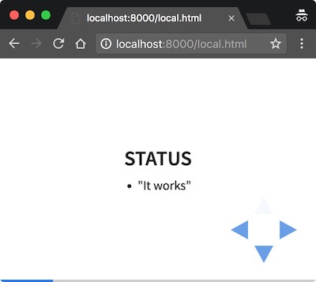

# Running reveal.js
<!-- markdownlint-disable MD012 -->
from .md



Note:
* Speakers notes go here


## Goals

* Use reveal.js, because:
  * it is nice
* Content in .md, because:
  * direct github views
  * simpler than html


## Status

* "It works"


## Example 1

Background & Fragments

<!-- .slide: data-background="#aa2222" -->

* Fragment 1 <!-- .element: class="fragment" data-fragment-index="1" -->


## Example: Background Image
<!-- .slide: data-background-image="background.jpg" -->

AWESOME!


## Example: Code

```shell
echo "Hello world."
exit 0
```


## Example: Autoplay Video
<video data-autoplay class="stretch" src="breakout.mov"></video>

Original: <https://www.youtube.com/watch?v=efexDg5q7Dw>


<div class="sl-block-content" data-placeholder-tag="h1" data-placeholder-text="Title Text" style="z-index: 10; background-color: rgba(33, 33, 33, 0.3);">
<h1>Example</h1>
<h2>background video</h2>

<!-- .slide: data-background-video="breakout.mov" data-background-video-loop="true"-->
<!-- .slide: data-background="#000000" -->
<span style="color: rgb(255, 0, 136);">
This is the color.
</span>
This is not.
</div>


## I like

* Repo-centric workflow
* Matches other workflows
  * Atom with linting
  * Publish in Github


## I'm dubious about

* Copy-paste code in repo, css/js/lib
* Not shipped in this package, you need your own
  [reveal.js checkout](https://github.com/hakimel/reveal.js/)
  * for .md parsing to work locally, had to download:
   [head.min.js](https://cdnjs.cloudflare.com/ajax/libs/headjs/0.96/head.min.js)
   separately


## Further study

* Styling
* Publishing:
  * Rendered presentation with GitHub pages?
  * -> Publish: .md file and PDF. Presentations locally.


## Standalone Setup

* Checkout / Fork this repo
* Go to the repo-dir
* Copy some reveal.js files
  * package.json & Gruntfile.js
  * js/ css/ plugin/ lib/
* Download:
```#!shell
curl https://cdnjs.cloudflare.com/ajax/libs/headjs/0.96/head.min.js >head.min.js
```


## Run locally

```#!shell
npm install
npm start
```

* Select [local.html](http://localhost:8000/local.html)
